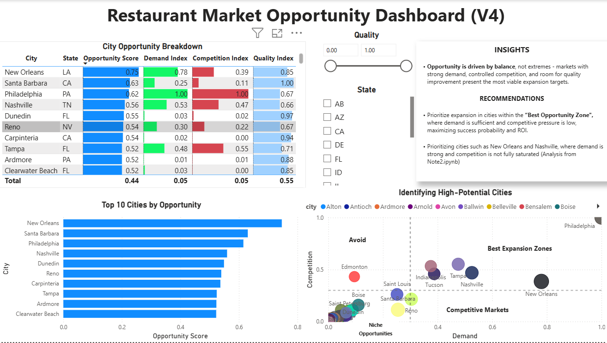

# Restaurant Market Opportunity Analysis

##  Overview

This project identifies the **best cities for restaurant expansion** using a data-driven approach based on Yelp data. It combines market demand, competition, and customer perception into a unified **Opportunity Score**, and presents insights through Python analysis and a Power BI dashboard.

---

##  Objective

> Identify cities with the most favorable market conditions for restaurant expansion by balancing demand, competition, and customer satisfaction.

---

## 📁 Project Structure
```YELP-ANALYSIS/
│
├── dashboard/
│ ├── yelp-analysis-dashboard.pbix
│ └── yelp-analysis-dashboard.png
│
├── dataset/
│ └── final_city.csv
│
├── notebooks/
│ ├── note1.ipynb
│ └── note2.ipynb
│
├── sql/
│ ├── Build Opportunity Score.sql
│ ├── category_summary.sql
│ ├── Create improved scoring table.sql
│ ├── create_city_metrics_table.sql
│ ├── create_cleaned_cuisines_table.sql
│ ├── create_restaurant_cuisines_table.sql
│ ├── create_restaurant_table.sql
│ └── export_review_table.sql
│
├── README.md
```
---

##  Data Pipeline (ETL)

- Leveraged BigQuery to process large-scale Yelp data (~7M reviews), enabling efficient aggregation and feature engineering

### Extract
- Imported Yelp business and review datasets into BigQuery  

### Transform
- Filtered restaurant-related businesses using category keywords  
- Aggregated data at the city level  
- Created key metrics:
  - Demand (review volume)
  - Competition (restaurant count)
  - Rating (average stars)
  - Sentiment (review-based score)

### Load
- Exported processed dataset (`final_city.csv`) for Python analysis and Power BI visualization  

SQL queries used for data extraction and transformation are stored in the `sql/` folder.

---

###  Technologies Used (Pipeline)

- **Google BigQuery**
- **SQL**
- **Python (Pandas)**

---

##  Dashboard Preview



*The dashboard enables stakeholders to identify high-opportunity markets by visualizing demand, competition, and quality across cities.*

---

##  Methodology

### Feature Engineering

| Feature | Description |
|--------|------------|
| Demand | Customer interest (review volume) |
| Competition | Number of restaurants |
| Rating | Average star rating |
| Sentiment | NLP-based review score |

---

### Opportunity Model (V1 → V4)

The model was iteratively refined:

- **V1**: Initial model  
- **V2**: Normalized sentiment  
- **V3**: Confidence-weighted sentiment  
- **V4 (Final)**: Balanced model reducing feature redundancy  

#### ✅ Final Model (V4)

Opportunity Score =  
0.45 × Demand + 0.30 × (1 − Competition) + 0.20 × Rating + 0.05 × Sentiment
---

### Model Validation

- **Correlation Analysis**
  - Demand ↔ Competition → strong correlation  
  - Rating ↔ Sentiment → high redundancy  

- **Feature Importance**
  - Identified over-weighting of rating in earlier models  
  - Adjusted weights to improve balance  

---

##  Power BI Dashboard

The dashboard is designed for **decision support**.

### Key Components

- Top Cities Table → prioritize markets  
- Demand vs Competition Scatter Plot → visualize positioning  
- Top 10 Bar Chart → quick comparison  
- Filters (State, Quality) → interactive exploration  

---

###  Key Design Choice

Instead of average lines, **constant thresholds (0.3)** define decision boundaries:

| Segment | Meaning |
|--------|--------|
| 🔥 High demand + low competition | Best opportunities |
| ⚠️ High demand + high competition | Competitive markets |
| ❌ Low demand | Limited potential |

---

##  Key Insights

- High-demand cities tend to also have high competition  
- Rating and sentiment are strongly correlated and provide limited additional signal  
- Opportunity is driven by balancing demand and competition  

---

## 🏆 Final Recommendation

Top markets identified:

- **New Orleans, LA** → strongest overall opportunity  
- **Philadelphia, PA** → high-demand but competitive  
- **Nashville, TN** → balanced growth opportunity  

Smaller high-rating cities were deprioritized due to limited demand and scalability.

---

##  Key Takeaway

> The most attractive markets are those that balance strong demand with manageable competition, rather than relying on high ratings alone.

---

##  Tools Used

- Python (Pandas, Scikit-learn, Matplotlib)  
- Power BI  
- Google BigQuery  
- SQL  

---

##  Project Highlights

- Built a **multi-stage opportunity model (V1 → V4)**  
- Designed an **ETL pipeline using BigQuery**  
- Created multiple SQL transformation layers for data processing  
- Identified and corrected **feature redundancy**  
- Validated model using correlation and feature importance  
- Developed a **decision-focused dashboard**  

---

##  Business Value

This project demonstrates how data can be used to:

- Identify high-potential expansion markets  
- Avoid oversaturated locations  
- Support strategic business decisions  

---

## 🔁 Reproducibility

This project is structured to be reproducible without storing raw Yelp data in the repository.

### 📦 Raw Data

Raw Yelp files are excluded due to file size. To reproduce the full pipeline:

- Download the Yelp dataset separately  
- Load the data into Google BigQuery  

---
### ⚙️ Environment Setup

Install dependencies:

```bash
pip install -r requirements.txt

---

# 🏁

👉 This project demonstrates end-to-end analytical thinking from data processing to business decision-making.```
---

## 👤 Author

**Emma Tran**  

🔗 LinkedIn: linkedin.com/in/tbdp138  
📧 Email: tbdp13895@gmail.com  

*Open to Data Analyst / Business Analyst opportunities*
